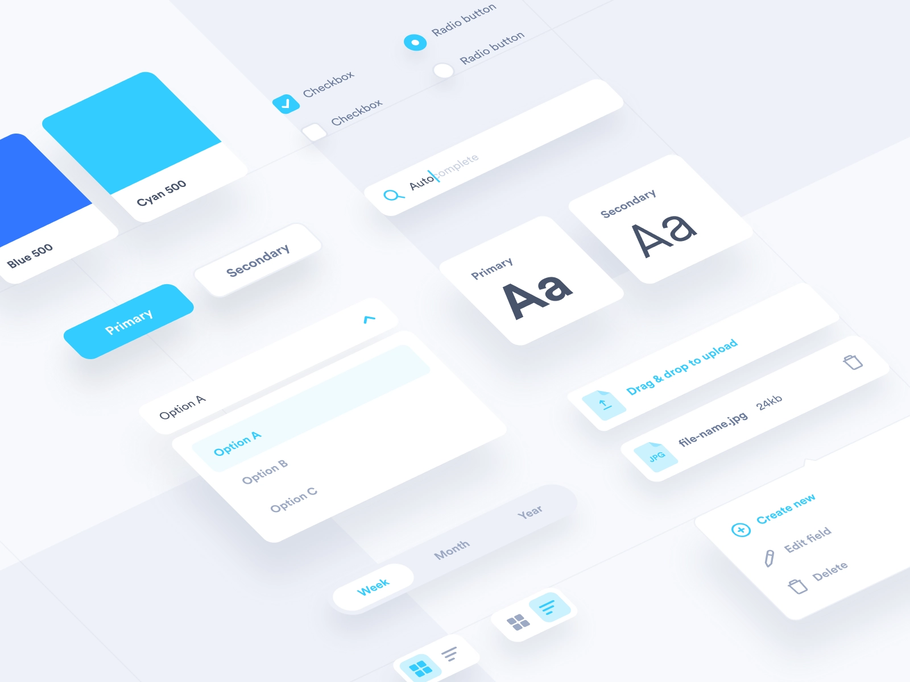

# DEV PACK - UI Kit 📱🎨

Welcome to the **DEV PACK - UI Kit** repository! This collection showcases a variety of Flutter UI projects demonstrating sleek and modern designs for various applications. Each project is designed with well-structured components, clear data models, and reusable widgets, making them perfect for easy reskinning and future logic integration.

## 📽 Preview

## 📚 Projects Overview

### 🧋 [Coffee UI](https://github.com/mo2men184/coffee-ui)
Coffee UI☕️, a sleek and modern Flutter UI project for a coffee shop app. This project features well-structured components, clear data models, and reusable widgets. It's UI-only, making it perfect for easy reskinning and future logic integration.

### ☕ [Starbucks UI](https://github.com/mo2men184/starbucks-ui)
Welcome to Starbucks UI☕️, a sleek and modern Flutter UI project for a coffee ordering app inspired by Starbucks. This project features well-structured components, clear data models, and reusable widgets. It's UI-only, making it perfect for easy reskinning and future logic integration.

### 🍱 [Foodie Delivery](https://github.com/mo2men184/foodie-delivery)
Welcome to **Foodie Delivery**, a sleek and modern Flutter UI project for a food delivery app. This project features well-structured components, clear data models, and reusable widgets. It's UI-only, making it perfect for easy reskinning and future logic integration.

### 🍔 [Delivery App](https://github.com/mo2men184/delivery_app)
Delivery App is a sleek and modern Flutter UI project for a food delivery app🍔, featuring well-structured components, clear data models, and reusable widgets. This project is UI-only, making it perfect for easy reskinning and future logic integration.

### 🍪 [Cookie Store](https://github.com/mo2men184/cookie_store)
Cookie Store is a delightful Flutter UI project for a cookie store app, featuring well-structured components, clear data models, and reusable widgets. This project is UI-only, making it perfect for easy reskinning and future logic integration.

### 🗺️ [Travel UI](https://github.com/mo2men184/travel-app-UI)
Travel UI is a sleek and modern Flutter UI project for a travel app, featuring well-structured components, clear data models, and reusable widgets. This project is UI-only, making it perfect for easy reskinning and future logic integration.

### 🎧 [Clubhouse Concept](https://github.com/mo2men184/clubhouse-concept-flutter)
Flutter UI project inspired by the Clubhouse app, featuring well-structured components, clear data models, and reusable widgets. This project is UI-only, making it perfect for easy reskinning and future logic integration.

### 🏠 [Rental App](https://github.com/mo2men184/Flutter-rental-app)
Sleek and modern Flutter UI project for a renting app, featuring well-structured components, clear data models, and reusable widgets. This project is UI-only, making it perfect for easy reskinning and future logic integration.

### 🦠 [COVID-19 UI](https://github.com/mo2men184/covid19)
A UI showcase for a COVID-19 information app, demonstrating clean and informative designs.

### 🚖 [RugbyRides Landing Page](https://github.com/mo2men184/RugbyRides-landing-FlutterWeb)
Flutter web app as landing page for RugbyRides - Flutter Taxi App.

### 🚕 [FlutterTaxi Driver](https://github.com/mo2men184/FlutterTaxi-Driver)
Driver app source code, fully built using Dart and Flutter.

### 🚗 [FlutterTaxi Rider](https://github.com/mo2men184/FlutterTaxi-Rider)
Rider app source code, Built using Dart and Flutter.

## 🚀 Getting Started

Each project is contained within its own directory with detailed instructions on how to set up and run the project. Explore the projects to see the best practices in action and use them as a reference or starting point for your own applications.

## 🤝 Contributing

Contributions, issues, and feature requests are welcome! Feel free to check the [issues page](https://github.com/mo2men184/DEV-UI-Pack/issues).

## 📝 License

This project is licensed under the MIT License.

---

💡 **Tip:** Customize this template to fit your specific use case. Happy coding! 🎉

## About the Developer 🌟

**👨‍💻Mo'men M.** is passionate about creating efficient and user-friendly mobile applications. With expertise in Flutter and Firebase, Mo'men focuses on delivering robust solutions that enhance user experiences and meet business objectives.

- 🌐 Website: [mmdev.studio](https://mmdev.studio/)
- 💼 LinkedIn: [mm-devstudio](https://www.linkedin.com/in/mm-devstudio/)
- 📸 Instagram: [devstudio_mm](https://www.instagram.com/devstudio_mm/)
- 📝 Upwork: [Mo'men M. on Upwork](https://upwork.com/freelancers/mo2men184)
- 💻 Freelancer: [devmo2 on Freelancer](https://www.freelancer.com/u/devmo2)
- 📧 Email: [dev.moamen.sr@gmail.com](mailto:dev.moamen.sr@gmail.com)
